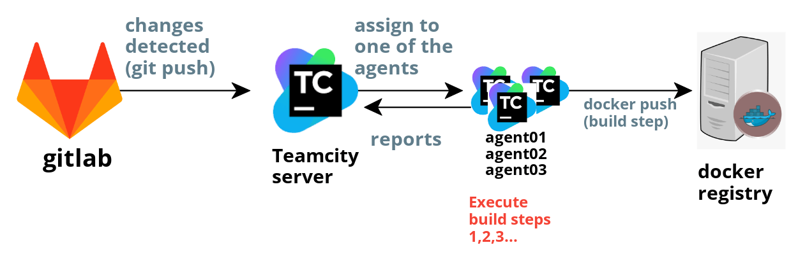

- Revision: 2023-03-21 junho

## CI/CD 구축
- [아키텍쳐 Overview](#아키텍쳐-overview)
- [0. 도커 레지스트리 서버 생성](#0-도커-레지스트리-서버-생성)
- [1. Gitlab 서버 생성](#1-gitlab-서버-생성)
- [2. TeamCity 서버 생성](#2-teamcity-서버-생성)
- [3. TeamCity 에이전트 생성](#3-TeamCity-에이전트-생성)
- [4. Gitlab 프로젝트 생성](#4-gitlab-프로젝트-생성)
- [5. TeamCity 프로젝트 생성](#5-teamcity-프로젝트-생성)
- [6. TeamCity 백업](#6-TeamCity-백업)


### 아키텍쳐 Overview

<br>


<br>

- 기본적인 TeamCity 서버/에이전트 [WorkFlow](https://www.jetbrains.com/help/teamcity/continuous-integration-with-teamcity.html#Basic+CI+Workflow+in+TeamCity):
	1. TeamCity 서버가 VCS root (repository) 변경감지
	2. 서버가 해당 변경을 Database에 저장
	3. 서버의 build설정에 정의된 trigger가 Database 변경감지하면 build실행
	4. build queue에 build가 추가됨
	5. build가 작업하지 않는 build agent에 배정됨.
	6. build agent가 build 설정에 정의된 build step 실행
	7. build agent는 로그, build process 및 결과를 서버에 실시간으로 전송
	8. build가 끝나면 build artifacts를 서버로 전송


- 테스트시에 구축한 WorkFlow:

<br>



<br>


### 0. 도커 레지스트리 서버 생성

- TeamCity에서 GitLab 소스를 Docker 이미지로 빌드하여, 저장할 도커 이미지 레지스트리 서버 구축 과정 정리
	- docker push는 TeamCity agent를 통해 실행하며, 기본적으로 https 통신이 권장됨
	- https 통신을 위해서, 해당 레지스트리 서버에 SSL 인증서를 생성하는 과정이 필요
		- self signed certificate 을 직접 생성하거나 인증된 기관 (CA)에서 발급 받는 방법이 있습니다.
		- 테스트 시에는 self signed certificate을 이용한 인증서 생성 방법을 선택

- 도커 private 레지스트리 생성 (https://172.16.6.77:5000)
	- [참고링크](https://dongle94.github.io/docker/docker-remote-private-registry/)
	- 빌드한 이미지를 저장하기 위한 이미지 저장소 서버
	1. On-premise 서버에서 docker registry 도커 컨테이너 프로세스 실행
	2. docker push (https 통신) 하기 위한 SSL/TLS 인증서 설치 (self signed)
	3. Registry Address: 172.16.6.77:5000
	- Username/Password:
	- 클라이언트에서 해당 registry에 접근하는 방법 2가지 . ([doc](https://docs.docker.com/registry/insecure/)
		- (SSL 인증서로 허용된 클라이언트 PC에서만 docker push/pull 사용 가능)
		1. Insecure registry
			- http access: w/o SSL/TLS certificate
			- 도커 데몬 `insecure-registries` 옵션으로 HTTPS 인증서 우회하여 docker push
		2. Secure registry (권장)
			- SSL/TLS certificate 설치하여 https 접근
			- 도커 레지스트리 구동시(docker run), `--insecure-registry` 옵션은 보안에 취약 하므로, SSL 인증서를 발급하는 방법 적용
			- 로컬->도커레지스트리 연결 https 접근 테스트
				- 레지스트리에 설치한 .crt 인증서 다운로드 하여 인증서 등록
			- 팀시티->도커레지스트리 연결 https 접근 테스트
				- .crt 인증서 팀시티 우분투 서버에 설치

```sh
# insecure access
vim C:\Users\k230303\.docker/daemon.json
	{
		"insecure-registries": ["172.16.6.77:5000"]
	}
```

- docker image 관련 참고 커맨드
```sh
# 도커 이미지 삭제
docker images | grep -v regi | awk '{ print "docker rmi " $3}' | sh
```


- [도커 원격 private 레지스트리](https://dongle94.github.io/docker/docker-remote-private-registry/) SSL 인증서 생성 steps:
	- key 생성
	- csr 생성
	- key 파일 암호 해제
	- config 파일 생성
	- crt 생성
	- SSL 생성
	- 기존 레지스트리 컨테이너 종료
	- 새로운 레지스트리 컨테이너 실행
	- 푸시 후 이미지 리스트 확인
	- curl로 확인

- 도커 private 리포지토리에 .crt 인증서 생성

```sh
openssl genrsa -des3 -out server.key 2048
openssl req -new -key server.key -out server.csr

openssl rsa -in server.key -out server.key
echo subjectAltName=IP:172.16.6.77,IP:127.0.0.1 > extfile.cnf
openssl x509 -req -days 10000 -signkey server.key -in server.csr -out server.crt -extfile extfile.cnf

sudo cp ~/docker-registry/server.crt /usr/local/share/ca-certificates/

sudo update-ca-certificates

docker run -d -p 5000:5000 --restart=always --name my_registry \
	-v /home/foo/docker-registry/volume/:/data \
	-v /home/foo/docker-registry/certs/:/certs \
	-e REGISTRY_HTTP_ADDR=0.0.0.0:5000 \
	-e REGISTRY_HTTP_TLS_CERTIFICATE=/certs/server.crt \
	-e REGISTRY_HTTP_TLS_KEY=/certs/server.key \
	registry:2.6
```

- 클라이언트 PC에 인증서 적용 및 `docker login` 하여 연결 확인
	- 로컬 윈도우 PC git bash에 적용
	- TeamCity 서버 호스트
	- TeamCity agent 도커 컨테이너 내부

```sh
scp -r krms@172.16.6.77:~/docker-registry/certs ~/

# 윈도우는 server.crt 더블클릭하여 직접설치
# docker 재시작

# 깃bash에서 확인
curl https://172.16.6.77:5000/v2/_catalog -k
	{"repositories":["my_image"]}
```

curl https://172.16.6.77:5000/v2/_catalog


```sh
# 클라이언트 PC에서 도커 리포지토리로 push/pull 테스트
docker tag my_image 172.16.6.77:5000/my_image

docker login 172.16.6.77:5000
docker push 172.16.6.77:5000/my_image
docker pull 172.16.6.77:5000/my_image

docker push jnuho/testgohttp_dockerhub:latest

## TeamCity가 아닌 로컬-> 레지스트리 테스트
go mod init devportal.kaonrms.com/konnect/YAML/on-premise/testgohttp
go mod tity
docker build -t my_image -f ./build/Dockerfile .
docker images
	REPOSITORY   TAG       IMAGE ID       CREATED         SIZE
	my_image     latest    0bbcb61acb59   6 seconds ago   320MB


docker tag my_image 172.16.6.77:5000/my_image

winpty docker login http://172.16.6.77:5000
docker push 172.16.6.77:5000/my_image
docker pull 172.16.6.77:5000/my_image

# 로컬 pc환경-> 도커 레지스트리서버
docker images
	mY-image ...

docker tag my_image 172.16.6.77:5000/my_image:latest
docker push 172.16.6.77:5000/my_image:latest
docker pull 172.16.6.77:5000/my_image:latest
```

### git bash에 .crt 인증서 추가

```sh
cat server.crt server.key > server.pem
openssl x509 -in server.crt -inform DER -out server.pem -outform PEM
```

- 참고: [Connecting to Insecure Registry](https://www.jetbrains.com/help/teamcity/configuring-connections-to-docker.html#Connecting+to+Insecure+Registry)


- 로컬 .crt -> 바스티온 

```sh
# 로컬
scp -r server.crt krms@172.16.6.222:/home/krms

# 바스티온
cp -r /home/krms/server.crt /etc/docker/certs.d/172.16.6.77:5000

# 바스티온 -> 도커 레지스트리 서버
docker login 172.16.6.77:5000
```


### 1. Gitlab 서버 생성


```yml
version: '3'
services:
  gitlab:
    image: 'gitlab/gitlab-ce:latest'
    container_name: gitlab
    restart: always
    ports:
      - '8080:80'
      - '1443:443'
      - '1001:22'
    volumes:
      # - './config:/etc/gitlab' # env variable를 override하므로 커멘트처리!
      - './logs:/var/log/gitlab'
      - './data:/var/opt/gitlab'
		environment:
      GITLAB_OMNIBUS_CONFIG: |
        external_url 'http://172.16.6.77:8080'
				nginx['listen_port'] = 80
				nginx['listen_https'] = false
    shm_size: '512m'

  agent01:
    container_name: agent01
    image: jetbrains/teamcity-agent:${TEAMCITY_VERSION}-linux-sudo
    ports:
      - "9090:9090"
    privileged: true
    volumes:
      - ./agent/conf:/data/teamcity_agent/conf
      - ./certs:/usr/local/share/ca-certificates
    tty: true
    user: "root"
    environment:
      - DOCKER_IN_DOCKER=start
      - SERVER_URL=http://172.16.6.84:8111
      - AGENT_NAME=agent01
    shm_size: '256m'
    command: >
      sh -c "update-ca-certificates && service docker start && /run-agent.sh && tail -f /dev/null"
```


- gitlab 컨테이너 내부에서 확인

```sh
docker exec -it gitlab /bin/bash
echo $GITLAB_OMNIBUS_CONFIG
	external_url 'http://172.16.6.77:8080'
	nginx['listen_port'] = 80
	nginx['listen_https'] = false
```

### 2. TeamCity 서버 생성


```sh
version: '3'
services:
  teamcity:
    image: jetbrains/teamcity-server:${TEAMCITY_VERSION}
    ports:
      - "8111:8111"
    volumes:
      - './data_dir:/data/teamcity_server/datadir'
      - './teamcity-server-logs:/opt/teamcity/logs'
    user: "root"
    shm_size: '128m'
```

- `.env` 파일

```
TEAMCITY_VERSION=2022.04
```

- 트러블슈팅
	- 팀시티 서버와 에이전트를 docker-compose.yml 추가 후, 컨테이너 간 통신관련

```
By adding the teamcity_network to the teamcity and teamcity-agent-1 services, you are creating a network bridge that allows these containers to communicate with each other over this network. Since the teamcity container is on this network and needs to access the external machine at 172.16.6.77:5000, the Docker network will handle the routing between the two.

In other words, the teamcity_network serves as a bridge network that connects the containers within it, and also provides a route to the external machine. When you specify a network for a container, Docker automatically adds a network interface to the container and assigns it an IP address within that network. This allows the containers on the same network to communicate with each other and also communicate with external machines on the same network.

By defining an external network, you are telling Docker that this network already exists and Docker should not try to create it. Therefore, when you start your Docker-compose file with the teamcity_network network, Docker will connect the containers to this pre-existing network, allowing them to communicate with each other and with external machines like the one at 172.16.6.77:5000.
```


### 3. TeamCity 에이전트 생성

- Gitlab서버와 같은서버에 docker-compose.yml로 도커 프로세스 실행

```yml
version: '3'
services:
  gitlab:
    image: 'gitlab/gitlab-ce:latest'
    container_name: gitlab
    restart: always
    ports:
      - '8080:80'
      - '1443:443'
      - '1001:22'
    volumes:
      - './config:/etc/gitlab'
      - './logs:/var/log/gitlab'
      - './data:/var/opt/gitlab'
    shm_size: '512m'

  agent01:
    container_name: agent01
    image: jetbrains/teamcity-agent:${TEAMCITY_VERSION}-linux-sudo
    ports:
      - "9090:9090"
    privileged: true
    volumes:
      - ./agent/conf:/data/teamcity_agent/conf
      - ./certs:/usr/local/share/ca-certificates
        #- /var/run/docker.sock:/var/run/docker.sock # mount Docker socket
    tty: true
    user: "root"
    environment:
      - DOCKER_IN_DOCKER=start
      - SERVER_URL=http://172.16.6.84:8111
      - AGENT_NAME=agent01
    shm_size: '256m'
    command: >
      sh -c "update-ca-certificates && service docker start && /run-agent.sh && tail -f /dev/null"
```


### 4. Gitlab 프로젝트 생성

- 소스 저장소 CI 구축

```sh
git clone https://devportal.kaonrms.com/konnect/YAML/on-premise/testgohttp.git

cd testgohttp
touch main.go
mkdir build
touch ./build/Dockerfile
go mod init devportal.kaonrms.com/konnect/YAML/on-premise/testgohttp
```

```go
package main

import (
	"fmt"
	"net/http"
)

func main() {
	http.HandleFunc("/", func(w http.ResponseWriter, r *http.Request) {
		fmt.Fprintf(w, "Hello World!")
	})

	http.ListenAndServe(":8080", nil)
}
```

```dockerfile
FROM golang:1.17-alpine as builder

WORKDIR /app

COPY . .

RUN go build -o main .

EXPOSE 8080

CMD ["./main"]
```

- dropdown > Admin > Application
	- Redirect URI: http://172.16.6.84:8111/oauth/gitlab/accessToken.html

### 5. TeamCity 프로젝트 생성

- TeamCity 프로젝트 설정
	- Administration > Project 페이지에서 다음 진행:
	- Create Project
		- Create Project From URL (공통계정 username/pw)
			- `{gitlab_url}.git`
		- Project name, VCS root, branch 등 설정
	- Prerequisite
		- 프로젝트 설정 > `VCS root`에 git url 등록
		- 프로젝트 설정 > `Trigger`에서 git 변화 감지시, Build Steps 실행
	- Build Steps 추가
		1. set short hash (command line)
		2. docker build
		3. docker push
	- parameters 추가 'GitShortHash=%GitShortHash%'
	- Connections 추가
		- Project Settings > Connections > Add Connections
			- GitLab: appliation-id, secretKey (깃랩 > Application 생성시)
		- Project Settings > Connections > Add Connections
	- Build Features > docker registry (choose just added docker registry connection)
		- NOTE: docker-compose로 teamcity 서버 실행시, .yml에 network 정의필요-> docker registry(외부ip) 접근가능

- VCS Root name
	- https://devportal.kaonrms.com/konnect/cs/krms-mail-sender.git#refs/heads/master

- Fetch URL
	- {gitlaburl}.git

- Default branch
	- refs/heads/master

- Branch Specification
	- refs/heads/*

- Password/Personal Access Token
	- docker_rep/

- Build steps : CLI

```sh
#!/bin/bash

hash=%build.vcs.number%
shortHash=${hash:0:7}
echo "###teamcity[setParameter name='GitShortHash' value='$shortHash']"
```


- Build steps : Docker build
	- image:tag
		- 172.16.6.77:5000/my_image:%GitShortHash%
		
- Build steps : Docker push


```sh
sync
echo 1 > /proc/sys/vm/drop_caches
```


### 6. TeamCity 백업


- 전체 프로젝트 세팅 및 데이터 전체 backup 및 import
	- Administration > Backup
	- Administration > Project Import

- 백업 테스트
	- teamcity서버 :8111 내리기
	- teamcity서버 :8112 올리기
	- teamcity에이전트 'agent02' 기동시작
	- teamcity서버 :8112 ./data_dir/import에 백업파일 올리고 시작


```sh
# TeamCity agent02 추가 후 신규 서버에 agent02 추가되는지 테스트
cd ~krms/test_gitlab
docker-compose down
docker-compose up -d

# TeamCity 신규 서버 구동 후 'Restore from backup'
# TeamCity_Backup_20230317_012048.zip 선택
cd ~krms
mkdir -p 2nd_test_teamcity/data_dir/import
cp test_teamcity/docker-compose.yml 2nd_test_teamcity/

cd ~krms/test_teamcity
docker-compose down

cd ~krms/2nd_test_teamcity
docker-compose up -d
```


### 7. TeamCity 프로젝트 단위 백업 또는 복사

- 백업
	- export: 기존 프로젝트
		- Edit Project Settings > Versioned Settings > Commit current project settings (kotlin)
	- import: 신규 프로젝트 .teamcity (.kts , .xml) 코드 커밋 & 푸시 후 Versioned Settings에서 Load project settings from VCS…
- 복사
	- 프로젝트  > Action > Copy project


